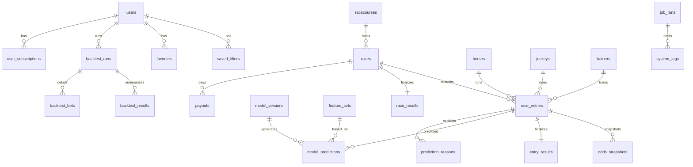

# 競馬予想ツール DB設計書 v1

## 1. 目的
本書は、競馬予想ツールMVPに必要なデータベース設計を定義する。
対象はJRA平地戦を前提とし、以下を成立させることを目的とする。

- 当日予想表示
- 履歴データ蓄積
- 特徴量生成
- モデル予測保存
- バックテスト実行
- 会員向け分析機能
- 運用監査

---

## 2. 設計方針

### 2.1 基本方針
- トランザクション系と分析系の中間設計とする
- まずは **PostgreSQL** を前提とする
- 公式データソースから取得した原本に近い情報と、アプリで使う正規化データを分離する
- 「レース前に存在した情報」と「レース後に確定した情報」を論理的に分離する
- モデル予測、バックテスト、監査ログは再現可能性を重視する

### 2.2 ID方針
- 内部主キー: `bigserial` または `uuid`
- 外部識別子: JRA/VAN等のコードを `external_*_code` として保持
- API/画面公開時は、必要に応じてUUIDまたは難読化IDを利用する

### 2.3 正規化方針
- マスタ系は第3正規形を基本とする
- 高頻度参照テーブルは、必要に応じて一部冗長化を許容する
- 予測や特徴量は監査しやすいようにバージョンと生成時刻を保持する

### 2.4 時系列整合性方針
- 未来情報リーク防止のため、レース前時点のデータスナップショットを保存する
- オッズ、馬体重、予測値は更新ごとに履歴を保持できる構造にする

---

## 3. データ領域

本システムのDBは以下の論理領域で構成する。

1. マスタ領域
   - 競馬場、馬、騎手、調教師、券種など
2. レース領域
   - レース、出走、結果、払戻、オッズ
3. 分析・予測領域
   - 特徴量セット、モデル、予測値、推奨理由
4. 会員領域
   - ユーザー、プラン、保存条件、お気に入り
5. バックテスト領域
   - 実行条件、結果サマリ、結果明細
6. 運用監査領域
   - ジョブ実行、監査ログ、障害ログ

---

## 4. ER設計の考え方

### 4.1 主なエンティティ関係
- 1開催日の中に複数レースが存在する
- 1レースに複数出走馬が存在する
- 1出走馬に対して複数時点のオッズスナップショットが存在する
- 1レース終了後にレース結果・出走結果・払戻が確定する
- 1出走に対して、複数モデルの予測値が紐づく
- 1ユーザーが複数の保存条件・バックテスト・お気に入りを持つ

### 4.2 概念ER図

---

## 5. テーブル一覧

| 区分 | テーブル名 | 役割 | MVP |
|---|---|---|---|
| マスタ | racecourses | 競馬場マスタ | ○ |
| マスタ | horses | 競走馬マスタ | ○ |
| マスタ | jockeys | 騎手マスタ | ○ |
| マスタ | trainers | 調教師マスタ | ○ |
| マスタ | bet_types | 券種マスタ | ○ |
| レース | races | レース基本情報 | ○ |
| レース | race_entries | 出走情報（レース前スナップショット中心） | ○ |
| レース | odds_snapshots | オッズ時系列 | ○ |
| レース | race_results | レース確定結果 | ○ |
| レース | entry_results | 各出走馬の確定結果 | ○ |
| レース | payouts | 払戻情報 | ○ |
| 分析 | feature_sets | 特徴量セット定義 | ○ |
| 分析 | model_versions | モデルバージョン管理 | ○ |
| 分析 | model_predictions | 予測値保存 | ○ |
| 分析 | prediction_reasons | 推奨理由・説明変数要約 | ○ |
| 会員 | users | 会員情報 | ○ |
| 会員 | user_subscriptions | 契約プラン履歴 | ○ |
| 会員 | saved_filters | 保存条件 | ○ |
| 会員 | favorites | お気に入り | ○ |
| バックテスト | backtest_runs | バックテスト実行管理 | ○ |
| バックテスト | backtest_results | バックテスト集計結果 | ○ |
| バックテスト | backtest_bets | バックテスト明細 | ○ |
| 運用 | job_runs | バッチ実行履歴 | ○ |
| 運用 | recommendation_audits | 推奨監査ログ | ○ |
| 運用 | system_logs | システムログ/障害ログ | ○ |

---

## 6. 命名規約・共通カラム

### 6.1 命名規約
- テーブル名: 複数形の英小文字スネークケース
- 主キー: `id`
- 外部キー: `<entity>_id`
- 外部識別子: `external_*_code`
- 日時: `*_at`
- 日付: `*_date`
- 真偽値: `is_*`

### 6.2 共通カラム
主要テーブルには以下を付与する。
- `created_at timestamp not null default now()`
- `updated_at timestamp not null default now()`
- `deleted_at timestamp null`（論理削除が必要な会員系中心）

---

## 7. テーブル定義（詳細）

## 7.1 racecourses
### 役割
競馬場マスタを保持する。

| カラム名 | 型 | PK | FK | Null | 説明 |
|---|---|---:|---:|---:|---|
| id | bigserial | ○ | - | NO | 内部ID |
| external_racecourse_code | varchar(20) | - | - | NO | 外部競馬場コード |
| name | varchar(100) | - | - | NO | 競馬場名 |
| short_name | varchar(20) | - | - | NO | 略称 |
| region | varchar(50) | - | - | YES | 地域 |
| is_active | boolean | - | - | NO | 有効フラグ |
| created_at | timestamp | - | - | NO | 作成日時 |
| updated_at | timestamp | - | - | NO | 更新日時 |

### 制約・インデックス
- UNIQUE(`external_racecourse_code`)
- INDEX(`name`)

### 更新タイミング
- 初期投入
- コード変更等があれば随時更新

---

## 7.2 horses
### 役割
競走馬マスタを保持する。

| カラム名 | 型 | PK | FK | Null | 説明 |
|---|---|---:|---:|---:|---|
| id | bigserial | ○ | - | NO | 内部ID |
| external_horse_code | varchar(30) | - | - | NO | 外部馬コード |
| name | varchar(120) | - | - | NO | 馬名 |
| sex | varchar(10) | - | - | YES | 性別 |
| birth_date | date | - | - | YES | 生年月日 |
| sire_name | varchar(120) | - | - | YES | 父名 |
| dam_name | varchar(120) | - | - | YES | 母名 |
| breeder_name | varchar(120) | - | - | YES | 生産者 |
| owner_name | varchar(120) | - | - | YES | 馬主 |
| retired_at | date | - | - | YES | 引退日 |
| created_at | timestamp | - | - | NO | 作成日時 |
| updated_at | timestamp | - | - | NO | 更新日時 |

### 制約・インデックス
- UNIQUE(`external_horse_code`)
- INDEX(`name`)
- INDEX(`birth_date`)

### 更新タイミング
- 新馬登録時
- 属性更新時

---

## 7.3 jockeys
| カラム名 | 型 | PK | FK | Null | 説明 |
|---|---|---:|---:|---:|---|
| id | bigserial | ○ | - | NO | 内部ID |
| external_jockey_code | varchar(30) | - | - | NO | 外部騎手コード |
| name | varchar(120) | - | - | NO | 騎手名 |
| affiliation | varchar(120) | - | - | YES | 所属 |
| created_at | timestamp | - | - | NO | 作成日時 |
| updated_at | timestamp | - | - | NO | 更新日時 |

### 制約・インデックス
- UNIQUE(`external_jockey_code`)
- INDEX(`name`)

### 更新タイミング
- 新規登録/変更時

---

## 7.4 trainers
| カラム名 | 型 | PK | FK | Null | 説明 |
|---|---|---:|---:|---:|---|
| id | bigserial | ○ | - | NO | 内部ID |
| external_trainer_code | varchar(30) | - | - | NO | 外部調教師コード |
| name | varchar(120) | - | - | NO | 調教師名 |
| affiliation | varchar(120) | - | - | YES | 所属 |
| created_at | timestamp | - | - | NO | 作成日時 |
| updated_at | timestamp | - | - | NO | 更新日時 |

### 制約・インデックス
- UNIQUE(`external_trainer_code`)
- INDEX(`name`)

### 更新タイミング
- 新規登録/変更時

---

## 7.5 bet_types
| カラム名 | 型 | PK | FK | Null | 説明 |
|---|---|---:|---:|---:|---|
| id | smallserial | ○ | - | NO | 内部ID |
| code | varchar(20) | - | - | NO | 券種コード（WIN/PLC/WIDE等） |
| name | varchar(50) | - | - | NO | 券種名 |
| is_mvp_target | boolean | - | - | NO | MVP対象フラグ |
| created_at | timestamp | - | - | NO | 作成日時 |
| updated_at | timestamp | - | - | NO | 更新日時 |

### 制約・インデックス
- UNIQUE(`code`)

### 更新タイミング
- 初期投入

---

## 7.6 races
### 役割
レース単位の基本情報を保持する。

| カラム名 | 型 | PK | FK | Null | 説明 |
|---|---|---:|---:|---:|---|
| id | bigserial | ○ | - | NO | 内部ID |
| external_race_code | varchar(40) | - | - | NO | 外部レースコード |
| race_date | date | - | - | NO | 開催日 |
| racecourse_id | bigint | - | ○ | NO | 競馬場ID |
| race_number | smallint | - | - | NO | レース番号 |
| race_name | varchar(200) | - | - | YES | レース名 |
| grade | varchar(20) | - | - | YES | G1/G2等 |
| class_name | varchar(100) | - | - | YES | クラス名 |
| track_type | varchar(20) | - | - | NO | 芝/ダート |
| distance_m | integer | - | - | NO | 距離 |
| turn_type | varchar(20) | - | - | YES | 右/左/直線 |
| weather | varchar(20) | - | - | YES | 天候 |
| going | varchar(20) | - | - | YES | 馬場状態 |
| scheduled_start_at | timestamp | - | - | YES | 発走予定日時 |
| field_size | smallint | - | - | YES | 頭数 |
| status | varchar(20) | - | - | NO | scheduled/open/closed/result_fixed |
| data_source | varchar(50) | - | - | NO | 取得元 |
| created_at | timestamp | - | - | NO | 作成日時 |
| updated_at | timestamp | - | - | NO | 更新日時 |

### 制約・インデックス
- UNIQUE(`external_race_code`)
- UNIQUE(`race_date`, `racecourse_id`, `race_number`)
- INDEX(`race_date`)
- INDEX(`racecourse_id`, `race_date`)
- INDEX(`track_type`, `distance_m`)
- INDEX(`status`, `scheduled_start_at`)

### 更新タイミング
- 出馬確定時に作成
- 馬場状態や頭数等を当日更新
- 結果確定後に `status` 更新

---

## 7.7 race_entries
### 役割
レース出走馬のレース前情報を保持する。

| カラム名 | 型 | PK | FK | Null | 説明 |
|---|---|---:|---:|---:|---|
| id | bigserial | ○ | - | NO | 内部ID |
| race_id | bigint | - | ○ | NO | レースID |
| horse_id | bigint | - | ○ | NO | 馬ID |
| jockey_id | bigint | - | ○ | YES | 騎手ID |
| trainer_id | bigint | - | ○ | YES | 調教師ID |
| bracket_number | smallint | - | - | YES | 枠番 |
| horse_number | smallint | - | - | NO | 馬番 |
| sex_age | varchar(20) | - | - | YES | 性齢表示 |
| carried_weight | numeric(5,1) | - | - | YES | 斤量 |
| declared_weight_kg | integer | - | - | YES | 馬体重 |
| declared_weight_diff_kg | integer | - | - | YES | 馬体重増減 |
| blinkers_flag | boolean | - | - | YES | ブリンカー |
| scratch_flag | boolean | - | - | NO | 取消フラグ |
| morning_line_popularity | smallint | - | - | YES | 想定人気等 |
| latest_win_odds | numeric(10,2) | - | - | YES | 最新単勝オッズキャッシュ |
| latest_place_odds_min | numeric(10,2) | - | - | YES | 最新複勝下限 |
| latest_place_odds_max | numeric(10,2) | - | - | YES | 最新複勝上限 |
| created_at | timestamp | - | - | NO | 作成日時 |
| updated_at | timestamp | - | - | NO | 更新日時 |

### 制約・インデックス
- UNIQUE(`race_id`, `horse_id`)
- UNIQUE(`race_id`, `horse_number`)
- INDEX(`horse_id`)
- INDEX(`jockey_id`)
- INDEX(`trainer_id`)
- INDEX(`race_id`, `latest_win_odds`)

### 更新タイミング
- 出馬表公開時に作成
- 当日オッズ・馬体重更新時に更新
- 取消時に `scratch_flag` 更新

---

## 7.8 odds_snapshots
### 役割
時点ごとのオッズ履歴を保持する。

| カラム名 | 型 | PK | FK | Null | 説明 |
|---|---|---:|---:|---:|---|
| id | bigserial | ○ | - | NO | 内部ID |
| race_entry_id | bigint | - | ○ | NO | 出走ID |
| snapshot_at | timestamp | - | - | NO | 取得時刻 |
| win_odds | numeric(10,2) | - | - | YES | 単勝オッズ |
| place_odds_min | numeric(10,2) | - | - | YES | 複勝下限 |
| place_odds_max | numeric(10,2) | - | - | YES | 複勝上限 |
| popularity | smallint | - | - | YES | 人気順 |
| source_status | varchar(20) | - | - | YES | normal/delayed/estimated |
| created_at | timestamp | - | - | NO | 作成日時 |

### 制約・インデックス
- UNIQUE(`race_entry_id`, `snapshot_at`)
- INDEX(`snapshot_at`)
- INDEX(`race_entry_id`, `snapshot_at` DESC)

### 更新タイミング
- レース当日に数分〜十数分間隔で取得
- 締切直前は高頻度取得を想定

---

## 7.9 race_results
### 役割
レース確定後のレース全体結果を保持する。

| カラム名 | 型 | PK | FK | Null | 説明 |
|---|---|---:|---:|---:|---|
| id | bigserial | ○ | - | NO | 内部ID |
| race_id | bigint | - | ○ | NO | レースID |
| result_fixed_at | timestamp | - | - | YES | 確定時刻 |
| winning_time | varchar(20) | - | - | YES | 勝ち時計 |
| pace_summary | varchar(50) | - | - | YES | ペース要約 |
| lap_text | text | - | - | YES | ラップ情報 |
| weather_final | varchar(20) | - | - | YES | 確定天候 |
| going_final | varchar(20) | - | - | YES | 確定馬場 |
| steward_notes | text | - | - | YES | 裁決/特記事項 |
| created_at | timestamp | - | - | NO | 作成日時 |
| updated_at | timestamp | - | - | NO | 更新日時 |

### 制約・インデックス
- UNIQUE(`race_id`)
- INDEX(`result_fixed_at`)

### 更新タイミング
- レース確定後に登録
- 裁決確定等の追記時に更新

---

## 7.10 entry_results
### 役割
各出走馬の確定着順情報を保持する。

| カラム名 | 型 | PK | FK | Null | 説明 |
|---|---|---:|---:|---:|---|
| id | bigserial | ○ | - | NO | 内部ID |
| race_entry_id | bigint | - | ○ | NO | 出走ID |
| finish_position | smallint | - | - | YES | 着順 |
| dead_heat_flag | boolean | - | - | NO | 同着フラグ |
| finish_time | varchar(20) | - | - | YES | 走破時計 |
| margin_text | varchar(50) | - | - | YES | 着差 |
| passing_order_text | varchar(50) | - | - | YES | 通過順位 |
| last3f | numeric(5,1) | - | - | YES | 上がり |
| final_corner_position | smallint | - | - | YES | 最終コーナー位置 |
| prize_money | numeric(12,0) | - | - | YES | 本賞金 |
| abnormal_result_code | varchar(20) | - | - | YES | 中止/失格等 |
| popularity_final | smallint | - | - | YES | 最終人気 |
| created_at | timestamp | - | - | NO | 作成日時 |
| updated_at | timestamp | - | - | NO | 更新日時 |

### 制約・インデックス
- UNIQUE(`race_entry_id`)
- INDEX(`finish_position`)
- INDEX(`popularity_final`)

### 更新タイミング
- レース確定後に登録
- 裁決変更時に更新

---

## 7.11 payouts
### 役割
払戻情報を保持する。

| カラム名 | 型 | PK | FK | Null | 説明 |
|---|---|---:|---:|---:|---|
| id | bigserial | ○ | - | NO | 内部ID |
| race_id | bigint | - | ○ | NO | レースID |
| bet_type_id | smallint | - | ○ | NO | 券種ID |
| combination_key | varchar(100) | - | - | NO | 組番表現 |
| payout_amount | integer | - | - | NO | 払戻金 |
| popularity | smallint | - | - | YES | 人気 |
| created_at | timestamp | - | - | NO | 作成日時 |

### 制約・インデックス
- UNIQUE(`race_id`, `bet_type_id`, `combination_key`)
- INDEX(`race_id`, `bet_type_id`)

### 更新タイミング
- レース確定後に登録

---

## 7.12 feature_sets
### 役割
特徴量セットの定義を管理する。

| カラム名 | 型 | PK | FK | Null | 説明 |
|---|---|---:|---:|---:|---|
| id | bigserial | ○ | - | NO | 内部ID |
| feature_set_name | varchar(100) | - | - | NO | 名称 |
| version | varchar(50) | - | - | NO | バージョン |
| description | text | - | - | YES | 説明 |
| feature_schema_json | jsonb | - | - | YES | 特徴量一覧定義 |
| training_cutoff_rule | text | - | - | YES | 未来情報防止ルール |
| is_active | boolean | - | - | NO | 利用中フラグ |
| created_at | timestamp | - | - | NO | 作成日時 |
| updated_at | timestamp | - | - | NO | 更新日時 |

### 制約・インデックス
- UNIQUE(`feature_set_name`, `version`)
- INDEX(`is_active`)

### 更新タイミング
- 特徴量設計変更時

---

## 7.13 model_versions
### 役割
学習済みモデルのメタ情報を保持する。

| カラム名 | 型 | PK | FK | Null | 説明 |
|---|---|---:|---:|---:|---|
| id | bigserial | ○ | - | NO | 内部ID |
| model_name | varchar(100) | - | - | NO | モデル名 |
| version | varchar(50) | - | - | NO | バージョン |
| model_type | varchar(50) | - | - | NO | logistic/lightgbm/ranker等 |
| feature_set_id | bigint | - | ○ | NO | 特徴量セットID |
| training_period_start | date | - | - | YES | 学習開始日 |
| training_period_end | date | - | - | YES | 学習終了日 |
| metrics_json | jsonb | - | - | YES | 評価指標 |
| artifact_path | varchar(255) | - | - | YES | モデル保管先 |
| is_production | boolean | - | - | NO | 本番利用中 |
| deployed_at | timestamp | - | - | YES | 本番反映日時 |
| created_at | timestamp | - | - | NO | 作成日時 |
| updated_at | timestamp | - | - | NO | 更新日時 |

### 制約・インデックス
- UNIQUE(`model_name`, `version`)
- INDEX(`feature_set_id`)
- INDEX(`is_production`)

### 更新タイミング
- モデル学習完了時
- 本番切替時

---

## 7.14 model_predictions
### 役割
レース前時点のモデル予測値を保存する。

| カラム名 | 型 | PK | FK | Null | 説明 |
|---|---|---:|---:|---:|---|
| id | bigserial | ○ | - | NO | 内部ID |
| race_entry_id | bigint | - | ○ | NO | 出走ID |
| model_version_id | bigint | - | ○ | NO | モデルID |
| feature_set_id | bigint | - | ○ | NO | 特徴量セットID |
| prediction_target | varchar(30) | - | - | NO | win/place_top3/ev_score等 |
| predicted_value | numeric(12,6) | - | - | NO | 予測値 |
| implied_probability | numeric(12,6) | - | - | YES | オッズ由来確率 |
| edge_value | numeric(12,6) | - | - | YES | 優位差分 |
| prediction_rank | smallint | - | - | YES | レース内順位 |
| predicted_at | timestamp | - | - | NO | 予測時刻 |
| source_odds_snapshot_at | timestamp | - | - | YES | 利用したオッズ時点 |
| created_at | timestamp | - | - | NO | 作成日時 |

### 制約・インデックス
- UNIQUE(`race_entry_id`, `model_version_id`, `prediction_target`, `predicted_at`)
- INDEX(`model_version_id`, `predicted_at`)
- INDEX(`race_entry_id`, `prediction_target`)
- INDEX(`prediction_target`, `prediction_rank`)

### 更新タイミング
- レース当日、予測再計算時に追加
- 監査のため原則更新ではなく追記

---

## 7.15 prediction_reasons
### 役割
推奨理由や説明可能性の要約を保存する。

| カラム名 | 型 | PK | FK | Null | 説明 |
|---|---|---:|---:|---:|---|
| id | bigserial | ○ | - | NO | 内部ID |
| model_prediction_id | bigint | - | ○ | NO | 予測ID |
| reason_type | varchar(30) | - | - | NO | strength/risk/feature |
| display_order | smallint | - | - | NO | 表示順 |
| title | varchar(100) | - | - | NO | 見出し |
| body | text | - | - | NO | 表示文 |
| score | numeric(12,6) | - | - | YES | 寄与スコア |
| created_at | timestamp | - | - | NO | 作成日時 |

### 制約・インデックス
- INDEX(`model_prediction_id`, `display_order`)
- INDEX(`reason_type`)

### 更新タイミング
- 予測生成時に作成

---

## 7.16 users
### 役割
会員情報を保持する。

| カラム名 | 型 | PK | FK | Null | 説明 |
|---|---|---:|---:|---:|---|
| id | uuid | ○ | - | NO | ユーザーID |
| email | varchar(255) | - | - | NO | メールアドレス |
| password_hash | varchar(255) | - | - | NO | ハッシュ化パスワード |
| display_name | varchar(120) | - | - | YES | 表示名 |
| role | varchar(20) | - | - | NO | user/admin |
| status | varchar(20) | - | - | NO | active/inactive/withdrawn |
| last_login_at | timestamp | - | - | YES | 最終ログイン |
| created_at | timestamp | - | - | NO | 作成日時 |
| updated_at | timestamp | - | - | NO | 更新日時 |
| deleted_at | timestamp | - | - | YES | 論理削除日時 |

### 制約・インデックス
- UNIQUE(`email`)
- INDEX(`role`, `status`)

### 更新タイミング
- 登録時
- ログイン時
- 会員状態変更時

---

## 7.17 user_subscriptions
### 役割
ユーザーの課金プラン履歴を保持する。

| カラム名 | 型 | PK | FK | Null | 説明 |
|---|---|---:|---:|---:|---|
| id | bigserial | ○ | - | NO | 内部ID |
| user_id | uuid | - | ○ | NO | ユーザーID |
| plan_code | varchar(50) | - | - | NO | free/basic/premium等 |
| status | varchar(20) | - | - | NO | active/canceled/past_due |
| started_at | timestamp | - | - | NO | 利用開始日時 |
| ended_at | timestamp | - | - | YES | 利用終了日時 |
| provider_subscription_id | varchar(100) | - | - | YES | 決済側契約ID |
| created_at | timestamp | - | - | NO | 作成日時 |
| updated_at | timestamp | - | - | NO | 更新日時 |

### 制約・インデックス
- INDEX(`user_id`, `status`)
- INDEX(`plan_code`, `status`)

### 更新タイミング
- 新規課金/更新/解約時

---

## 7.18 saved_filters
### 役割
ユーザー保存条件を保持する。

| カラム名 | 型 | PK | FK | Null | 説明 |
|---|---|---:|---:|---:|---|
| id | bigserial | ○ | - | NO | 内部ID |
| user_id | uuid | - | ○ | NO | ユーザーID |
| filter_name | varchar(100) | - | - | NO | 条件名 |
| filter_type | varchar(30) | - | - | NO | race_analysis/backtest等 |
| filter_json | jsonb | - | - | NO | 条件JSON |
| is_default | boolean | - | - | NO | 既定フラグ |
| created_at | timestamp | - | - | NO | 作成日時 |
| updated_at | timestamp | - | - | NO | 更新日時 |
| deleted_at | timestamp | - | - | YES | 論理削除日時 |

### 制約・インデックス
- INDEX(`user_id`)
- INDEX(`user_id`, `filter_type`)
- INDEX USING GIN(`filter_json`)

### 更新タイミング
- 保存/編集/削除時

---

## 7.19 favorites
### 役割
ユーザーのお気に入りレース・馬を保持する。

| カラム名 | 型 | PK | FK | Null | 説明 |
|---|---|---:|---:|---:|---|
| id | bigserial | ○ | - | NO | 内部ID |
| user_id | uuid | - | ○ | NO | ユーザーID |
| favorite_type | varchar(20) | - | - | NO | race/horse |
| race_id | bigint | - | ○ | YES | レースID |
| horse_id | bigint | - | ○ | YES | 馬ID |
| created_at | timestamp | - | - | NO | 作成日時 |

### 制約・インデックス
- CHECK(`favorite_type` in ('race','horse'))
- INDEX(`user_id`, `favorite_type`)
- UNIQUE(`user_id`, `race_id`) WHERE `race_id` IS NOT NULL
- UNIQUE(`user_id`, `horse_id`) WHERE `horse_id` IS NOT NULL

### 更新タイミング
- 追加/削除時

---

## 7.20 backtest_runs
### 役割
バックテスト実行単位を管理する。

| カラム名 | 型 | PK | FK | Null | 説明 |
|---|---|---:|---:|---:|---|
| id | bigserial | ○ | - | NO | 内部ID |
| user_id | uuid | - | ○ | NO | ユーザーID |
| run_name | varchar(100) | - | - | YES | 実行名 |
| status | varchar(20) | - | - | NO | queued/running/completed/failed |
| parameters_json | jsonb | - | - | NO | 条件JSON |
| started_at | timestamp | - | - | YES | 開始日時 |
| finished_at | timestamp | - | - | YES | 終了日時 |
| error_message | text | - | - | YES | エラー内容 |
| created_at | timestamp | - | - | NO | 作成日時 |

### 制約・インデックス
- INDEX(`user_id`, `created_at` DESC)
- INDEX(`status`)
- INDEX USING GIN(`parameters_json`)

### 更新タイミング
- 実行登録時/完了時

---

## 7.21 backtest_results
### 役割
バックテストの集計結果を保持する。

| カラム名 | 型 | PK | FK | Null | 説明 |
|---|---|---:|---:|---:|---|
| id | bigserial | ○ | - | NO | 内部ID |
| backtest_run_id | bigint | - | ○ | NO | 実行ID |
| bet_type_id | smallint | - | ○ | NO | 券種ID |
| race_count | integer | - | - | NO | 対象レース数 |
| bet_count | integer | - | - | NO | 購入件数 |
| hit_count | integer | - | - | NO | 的中件数 |
| stake_amount | numeric(14,2) | - | - | NO | 購入総額 |
| payout_amount | numeric(14,2) | - | - | NO | 払戻総額 |
| roi | numeric(12,6) | - | - | NO | 回収率 |
| hit_rate | numeric(12,6) | - | - | NO | 的中率 |
| max_drawdown | numeric(12,6) | - | - | YES | 最大DD |
| avg_odds | numeric(12,6) | - | - | YES | 平均オッズ |
| created_at | timestamp | - | - | NO | 作成日時 |

### 制約・インデックス
- INDEX(`backtest_run_id`)
- INDEX(`bet_type_id`)

### 更新タイミング
- 実行完了時に登録

---

## 7.22 backtest_bets
### 役割
バックテストの購入明細を保持する。

| カラム名 | 型 | PK | FK | Null | 説明 |
|---|---|---:|---:|---:|---|
| id | bigserial | ○ | - | NO | 内部ID |
| backtest_run_id | bigint | - | ○ | NO | 実行ID |
| race_id | bigint | - | ○ | NO | レースID |
| race_entry_id | bigint | - | ○ | YES | 出走ID |
| bet_type_id | smallint | - | ○ | NO | 券種ID |
| selection_key | varchar(100) | - | - | NO | 購入組番 |
| stake_amount | numeric(12,2) | - | - | NO | 購入額 |
| payout_amount | numeric(12,2) | - | - | NO | 払戻額 |
| is_hit | boolean | - | - | NO | 的中フラグ |
| prediction_value | numeric(12,6) | - | - | YES | 使用予測値 |
| edge_value | numeric(12,6) | - | - | YES | 優位差分 |
| created_at | timestamp | - | - | NO | 作成日時 |

### 制約・インデックス
- INDEX(`backtest_run_id`)
- INDEX(`race_id`)
- INDEX(`is_hit`)

### 更新タイミング
- 実行完了時にバルク登録

---

## 7.23 job_runs
### 役割
データ同期や学習ジョブの実行履歴を保持する。

| カラム名 | 型 | PK | FK | Null | 説明 |
|---|---|---:|---:|---:|---|
| id | bigserial | ○ | - | NO | 内部ID |
| job_name | varchar(100) | - | - | NO | ジョブ名 |
| job_type | varchar(50) | - | - | NO | ingest/feature/train/predict |
| status | varchar(20) | - | - | NO | queued/running/success/failed |
| started_at | timestamp | - | - | YES | 開始日時 |
| finished_at | timestamp | - | - | YES | 終了日時 |
| target_date | date | - | - | YES | 対象日 |
| records_processed | integer | - | - | YES | 処理件数 |
| error_summary | text | - | - | YES | エラー要約 |
| created_at | timestamp | - | - | NO | 作成日時 |

### 制約・インデックス
- INDEX(`job_type`, `status`)
- INDEX(`target_date`)
- INDEX(`started_at` DESC)

### 更新タイミング
- ジョブ開始/完了時

---

## 7.24 recommendation_audits
### 役割
どのデータ・モデルで推奨を出したかを監査する。

| カラム名 | 型 | PK | FK | Null | 説明 |
|---|---|---:|---:|---:|---|
| id | bigserial | ○ | - | NO | 内部ID |
| race_id | bigint | - | ○ | NO | レースID |
| race_entry_id | bigint | - | ○ | YES | 出走ID |
| model_version_id | bigint | - | ○ | NO | モデルID |
| feature_set_id | bigint | - | ○ | NO | 特徴量セットID |
| prediction_generated_at | timestamp | - | - | NO | 予測生成時刻 |
| published_at | timestamp | - | - | YES | 公開時刻 |
| payload_json | jsonb | - | - | NO | 表示内容スナップショット |
| created_at | timestamp | - | - | NO | 作成日時 |

### 制約・インデックス
- INDEX(`race_id`, `published_at`)
- INDEX(`model_version_id`)
- INDEX USING GIN(`payload_json`)

### 更新タイミング
- 推奨生成・公開時

---

## 7.25 system_logs
### 役割
アプリ/バッチの障害や運用ログを保持する。

| カラム名 | 型 | PK | FK | Null | 説明 |
|---|---|---:|---:|---:|---|
| id | bigserial | ○ | - | NO | 内部ID |
| job_run_id | bigint | - | ○ | YES | ジョブ実行ID |
| level | varchar(20) | - | - | NO | info/warn/error |
| event_type | varchar(50) | - | - | NO | 事象種別 |
| message | text | - | - | NO | メッセージ |
| context_json | jsonb | - | - | YES | 詳細文脈 |
| occurred_at | timestamp | - | - | NO | 発生日時 |
| created_at | timestamp | - | - | NO | 作成日時 |

### 制約・インデックス
- INDEX(`job_run_id`)
- INDEX(`level`, `occurred_at` DESC)
- INDEX(`event_type`)
- INDEX USING GIN(`context_json`)

### 更新タイミング
- 随時追記

---

## 8. 推奨インデックス戦略

### 8.1 高優先
- `races(race_date, racecourse_id)`
- `race_entries(race_id, horse_number)`
- `odds_snapshots(race_entry_id, snapshot_at desc)`
- `model_predictions(race_entry_id, prediction_target, predicted_at desc)`
- `entry_results(race_entry_id)`
- `payouts(race_id, bet_type_id)`
- `backtest_runs(user_id, created_at desc)`

### 8.2 JSON検索用
- `saved_filters.filter_json` にGIN
- `backtest_runs.parameters_json` にGIN
- `recommendation_audits.payload_json` にGIN
- `system_logs.context_json` にGIN

### 8.3 将来のパーティション候補
データ量増加時は以下を月次または年次でパーティションする。
- `races`（`race_date`）
- `odds_snapshots`（`snapshot_at`）
- `model_predictions`（`predicted_at`）
- `system_logs`（`occurred_at`）

---

## 9. 更新タイミング一覧

| テーブル名 | 主な更新契機 | 更新方式 |
|---|---|---|
| racecourses | マスタ更新 | upsert |
| horses | 馬情報更新 | upsert |
| jockeys | 騎手情報更新 | upsert |
| trainers | 調教師情報更新 | upsert |
| races | 出馬表公開/当日更新/結果確定 | upsert |
| race_entries | 出馬表公開/当日更新/取消 | upsert |
| odds_snapshots | 定期取得 | insert-only |
| race_results | 結果確定 | upsert |
| entry_results | 結果確定 | upsert |
| payouts | 結果確定 | upsert |
| feature_sets | 特徴量更新 | insert + state update |
| model_versions | 学習完了/本番反映 | insert + state update |
| model_predictions | 推論実行 | insert-only |
| prediction_reasons | 推論実行 | insert-only |
| users | 登録/更新 | upsert |
| user_subscriptions | 課金イベント | insert + state update |
| saved_filters | UI操作 | upsert |
| favorites | UI操作 | insert/delete |
| backtest_runs | 実行開始/終了 | insert + update |
| backtest_results | 実行完了 | insert |
| backtest_bets | 実行完了 | bulk insert |
| job_runs | バッチ開始/終了 | insert + update |
| recommendation_audits | 推奨生成/公開 | insert |
| system_logs | 随時 | insert |

---

## 10. 代表的なクエリ要件

### 10.1 当日推奨一覧
必要JOIN:
- `races`
- `race_entries`
- `model_predictions`
- 必要に応じて `prediction_reasons`

### 10.2 レース詳細
必要JOIN:
- `races`
- `race_entries`
- `horses`
- `jockeys`
- `trainers`
- 最新 `odds_snapshots` または `race_entries` キャッシュ列
- `model_predictions`
- `prediction_reasons`

### 10.3 条件分析
必要JOIN:
- `races`
- `race_entries`
- `entry_results`
- `payouts`
- `model_predictions`

### 10.4 バックテスト
入力:
- レース履歴
- 確定オッズ/払戻
- 予測値
出力:
- `backtest_runs`
- `backtest_results`
- `backtest_bets`

---

## 11. データ品質・監査要件

### 11.1 品質チェック
- `races.field_size` と `race_entries` 件数の整合性チェック
- `entry_results.finish_position` 欠損チェック
- 取消馬への払戻・予測残存チェック
- 同一レースの予測件数不足チェック

### 11.2 監査要件
- 予測値には必ず `model_version_id`, `feature_set_id`, `predicted_at` を付与する
- 公開した推奨は `recommendation_audits` に保存する
- ジョブ失敗時は `job_runs` と `system_logs` に必ず記録する

---

## 12. 将来拡張方針

### 12.1 地方競馬対応
追加候補:
- `organizations`（JRA/NAR等）
- `racecourses` に主催区分追加
- 地方独自項目を吸収する拡張カラムまたはサブテーブル

### 12.2 券種拡張
- `bet_types` に三連単等を追加
- `payouts.combination_key` の表現ルールを統一
- バックテスト明細で複数選択キーを扱えるようにする

### 12.3 B2B/API提供
- API利用監査テーブル
- 顧客別権限制御テーブル
- 予測配信スナップショットの保持期間設定

---

## 13. MVP時点の実装優先順位

### 優先度A
- racecourses
- horses
- jockeys
- trainers
- bet_types
- races
- race_entries
- odds_snapshots
- race_results
- entry_results
- payouts
- feature_sets
- model_versions
- model_predictions
- prediction_reasons
- users
- user_subscriptions
- saved_filters
- favorites
- backtest_runs
- backtest_results
- job_runs
- recommendation_audits
- system_logs

### 優先度B
- backtest_bets
- 高度監査用の追加スナップショット
- 会員管理補助テーブル

---

## 14. 未解決論点
- 外部コード体系の正式仕様に合わせた桁数調整
- 馬体重やオッズの取得頻度上限
- 特徴量をRDBに持つか、ファイルストア/分析基盤に持つか
- 説明可能性データの保存粒度（全文保存か要約保存か）
- 有料会員の課金基盤との同期仕様
- 大量バックテスト時の集計先をRDBのままにするか分析基盤へ逃がすか
