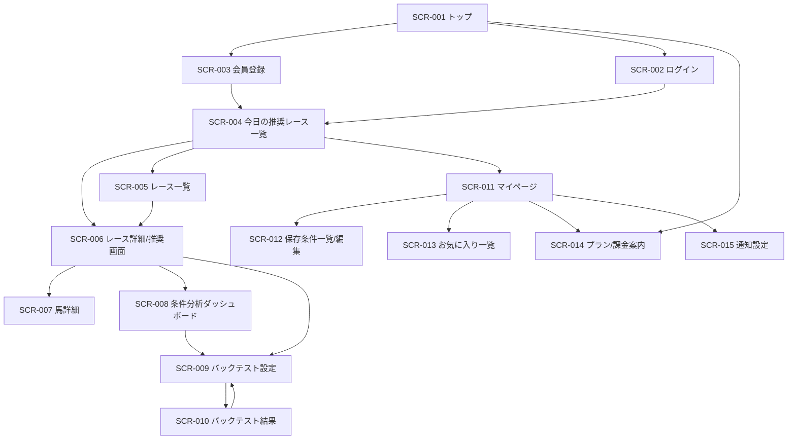
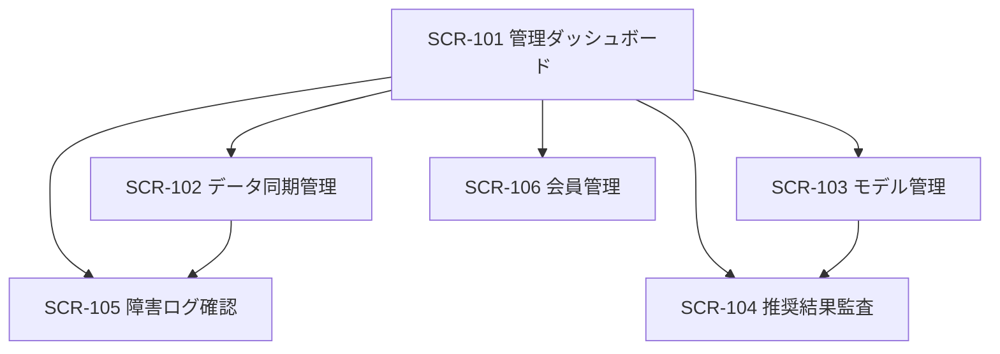

# 競馬予想ツール 画面設計書 v1

## 1. 目的
本書は、競馬予想ツールのMVPにおける画面一覧、各画面の目的、主要UI要素、利用権限、画面遷移、および将来拡張の考え方を定義する。

前提:
- 対象はJRA平地戦
- プロダクトの主価値は「期待値ベースの意思決定支援」
- 初期券種は単勝・複勝・ワイド
- 買い目自動生成ではなく、分析・比較・検証を主機能とする

---

## 2. 画面設計方針

### 2.1 基本方針
- 初見ユーザーでも「今日どのレースを見るべきか」がすぐ分かる構成にする
- AIの印だけを見せず、推奨根拠・期待値・リスクをセットで表示する
- モバイル閲覧を前提に、PCでは情報量を拡張表示する
- 予想表示画面と検証画面を明確に分ける
- 課金価値は「より深い比較・条件保存・通知・高度分析」に置く

### 2.2 権限区分
- 未ログインユーザー
- 無料会員
- 有料会員
- 管理者

### 2.3 ナビゲーション方針
グローバルナビゲーション候補:
- 今日の推奨
- レース一覧
- 条件分析
- バックテスト
- マイページ
- お知らせ

管理者用ナビゲーション候補:
- データ同期
- モデル管理
- 障害ログ
- 会員管理

---

## 3. 画面一覧

| 画面ID | 画面名 | 主利用者 | 目的 | MVP対象 |
|---|---|---|---|---|
| SCR-001 | トップ/ランディング | 全員 | サービス概要と導線提示 | ○ |
| SCR-002 | ログイン | 会員 | 認証 | ○ |
| SCR-003 | 会員登録 | 未ログイン | 新規登録 | ○ |
| SCR-004 | 今日の推奨レース一覧 | 無料/有料 | 今日注目すべきレースと推奨の確認 | ○ |
| SCR-005 | レース一覧 | 無料/有料 | 開催日・場・条件からレースを探す | ○ |
| SCR-006 | レース詳細/推奨画面 | 無料/有料 | レースごとの予想・期待値・根拠確認 | ○ |
| SCR-007 | 馬詳細モーダル/画面 | 無料/有料 | 各馬の詳細評価を確認 | ○ |
| SCR-008 | 条件分析ダッシュボード | 有料 | 条件別回収率・成績分析 | ○ |
| SCR-009 | バックテスト設定 | 有料 | 条件・閾値・券種を指定して検証 | ○ |
| SCR-010 | バックテスト結果 | 有料 | シミュレーション結果確認 | ○ |
| SCR-011 | マイページ | 無料/有料 | 会員情報・保存条件・利用状況管理 | ○ |
| SCR-012 | 保存条件一覧/編集 | 有料 | フィルタ条件保存 | ○ |
| SCR-013 | お気に入り一覧 | 無料/有料 | お気に入りレース・馬の管理 | ○ |
| SCR-014 | プラン/課金案内 | 無料/有料 | 料金案内とアップグレード誘導 | ○ |
| SCR-015 | 通知設定 | 有料 | アラート条件設定 | △ Phase2 |
| SCR-101 | 管理画面ダッシュボード | 管理者 | 運用状況の確認 | ○ |
| SCR-102 | データ同期管理 | 管理者 | 取得ジョブ状態の確認・再実行 | ○ |
| SCR-103 | モデル管理 | 管理者 | 学習・反映モデル管理 | ○ |
| SCR-104 | 推奨結果監査 | 管理者 | どのモデル/データで推奨したか確認 | ○ |
| SCR-105 | 障害ログ確認 | 管理者 | エラー確認 | ○ |
| SCR-106 | 会員管理 | 管理者 | 会員状態・プランの確認 | △ |

---

## 4. 画面詳細

## 4.1 SCR-001 トップ/ランディング
### 目的
- サービス価値の理解促進
- 無料登録・有料化への導線提供

### 想定ユーザー
- 未ログインユーザー
- 無料会員

### 主要UI要素
- ヒーローセクション
- サービス説明
- 主な機能紹介
- 実績表示サンプル
- 無料登録ボタン
- ログインボタン
- 料金プラン導線
- 法務注意表示

### 主要アクション
- 会員登録へ進む
- ログインする
- 今日の推奨サンプルを見る
- 料金を見る

### 権限
- 全員閲覧可

---

## 4.2 SCR-002 ログイン
### 目的
- 会員認証

### 主要UI要素
- メールアドレス
- パスワード
- ログインボタン
- パスワード再設定導線
- 会員登録導線

### 権限
- 全員利用可

---

## 4.3 SCR-003 会員登録
### 目的
- 新規会員登録

### 主要UI要素
- 名前/ニックネーム
- メールアドレス
- パスワード
- 利用規約同意
- 登録ボタン
- ログイン導線

### 権限
- 未ログインのみ

---

## 4.4 SCR-004 今日の推奨レース一覧
### 目的
- 当日見るべきレースを素早く判断させる

### 主要UI要素
- 開催日セレクタ
- 場フィルタ
- レース品質フィルタ
- 推奨レースカード
- 期待値上位レースバッジ
- 有料会員向け詳細解放導線

### レースカード表示項目
- 開催場
- レース番号
- 発走時刻
- コース/距離
- 馬場状態
- 推奨馬数
- レース注目度
- 想定妙味スコア

### 主要アクション
- レース詳細へ遷移
- お気に入り登録
- 条件保存

### 権限
- 無料会員: 一部項目閲覧
- 有料会員: 全項目閲覧

---

## 4.5 SCR-005 レース一覧
### 目的
- 条件指定でレースを検索する

### 主要UI要素
- 日付フィルタ
- 場名フィルタ
- 芝/ダート切替
- 距離帯フィルタ
- クラスフィルタ
- 一覧テーブル/カード表示切替

### 一覧表示項目
- 日付
- 場名
- レース番号
- 条件名
- 距離
- 頭数
- 発走時刻

### 主要アクション
- レース詳細へ遷移

### 権限
- 無料/有料会員

---

## 4.6 SCR-006 レース詳細/推奨画面
### 目的
- レースごとの推奨馬・期待値・根拠を確認する

### 主要UI要素
- レース基本情報ヘッダ
- レースの総評
- 推奨馬ランキング
- 出走馬一覧テーブル
- 券種別簡易評価
- リスク注意表示
- お気に入りボタン
- シェア/コピー導線（内部利用想定）

### 出走馬一覧の主要表示項目
- 枠番/馬番
- 馬名
- 騎手
- 単勝オッズ
- 複勝オッズ帯
- 勝率予測
- 複勝率予測
- 期待値スコア
- 過小評価度
- 推奨理由要約

### タブ構成案
- 推奨ランキング
- 全頭比較
- 近走分析
- オッズ比較
- 回収率参考

### 主要アクション
- 馬詳細を開く
- 並び替え
- フィルタ変更
- バックテスト条件へ引き継ぐ

### 権限
- 無料会員: 上位数頭まで/一部数値マスク
- 有料会員: 詳細全開放

---

## 4.7 SCR-007 馬詳細モーダル/画面
### 目的
- 個別馬の判断材料を深掘りする

### 主要UI要素
- 基本プロフィール
- 直近成績サマリ
- 同条件成績
- 騎手相性
- 脚質傾向
- 推奨理由詳細
- 注意点

### 表示項目例
- 直近3走着順
- 同距離成績
- 同競馬場成績
- 上がり順位傾向
- 休み明け指数
- クラス昇降影響

### 権限
- 無料会員: 一部制限
- 有料会員: 全表示

---

## 4.8 SCR-008 条件分析ダッシュボード
### 目的
- 回収率と成績を条件別に分析する

### 主要UI要素
- 条件フィルタ群
- KPIカード
- 回収率推移グラフ
- 条件別集計テーブル
- 競馬場別比較
- 距離別比較
- 馬場別比較

### 主な表示KPI
- 回収率
- 的中率
- レース数
- 賭け数
- 平均オッズ
- 最大ドローダウン

### 権限
- 有料会員のみ

---

## 4.9 SCR-009 バックテスト設定
### 目的
- シミュレーション条件を指定する

### 主要UI要素
- 対象期間
- 券種選択
- 期待値閾値
- オッズ条件
- レース条件
- 賭け金ルール
- 実行ボタン

### 権限
- 有料会員のみ

---

## 4.10 SCR-010 バックテスト結果
### 目的
- シミュレーション結果を確認する

### 主要UI要素
- サマリKPI
- 資金推移グラフ
- 日別/週別推移
- 購入履歴テーブル
- 条件別成績
- CSV出力ボタン

### 権限
- 有料会員のみ

---

## 4.11 SCR-011 マイページ
### 目的
- 会員設定・プラン状態の確認

### 主要UI要素
- 会員基本情報
- 契約プラン表示
- 利用履歴サマリ
- 保存条件一覧導線
- お気に入り一覧導線
- 通知設定導線

### 権限
- ログイン会員

---

## 4.12 SCR-012 保存条件一覧/編集
### 目的
- よく使う分析条件を保存・再利用する

### 主要UI要素
- 保存条件一覧
- 新規保存ボタン
- 編集ボタン
- 削除ボタン
- 既定条件設定

### 権限
- 有料会員

---

## 4.13 SCR-013 お気に入り一覧
### 目的
- お気に入り登録したレース・馬を再確認する

### 主要UI要素
- お気に入りレース一覧
- お気に入り馬一覧
- 開催日フィルタ
- 削除ボタン

### 権限
- ログイン会員

---

## 4.14 SCR-014 プラン/課金案内
### 目的
- プラン差分を明示し、有料会員化を促進する

### 主要UI要素
- 無料/有料比較表
- 利用可能機能一覧
- 料金表示
- アップグレード導線
- FAQ

### 権限
- 全員閲覧可

---

## 4.15 SCR-015 通知設定（Phase2）
### 目的
- 期待値条件に応じた通知設定を行う

### 主要UI要素
- 通知ON/OFF
- 条件閾値
- 対象場指定
- 券種指定
- 締切前通知設定

### 権限
- 有料会員

---

## 4.16 管理画面群

### SCR-101 管理画面ダッシュボード
- データ同期成功率
- 本日対象レース数
- 推奨生成件数
- 失敗ジョブ件数
- 直近アラート

### SCR-102 データ同期管理
- ジョブ一覧
- 最終実行時刻
- ステータス
- 再実行ボタン
- 欠損アラート

### SCR-103 モデル管理
- モデル一覧
- 学習期間
- 特徴量バージョン
- 評価指標
- 本番反映状態

### SCR-104 推奨結果監査
- レースごとの推奨履歴
- 使用モデル
- 使用データスナップショット
- 出力時刻

### SCR-105 障害ログ確認
- エラー一覧
- 発生時刻
- 重要度
- 原因種別
- 詳細ログリンク

### SCR-106 会員管理
- 会員一覧
- プラン状態
- 退会状態
- 問い合わせ連携

---

## 5. 主要ユーザーフロー

## 5.1 新規ユーザーの初回利用フロー
1. トップ画面を見る
2. 会員登録する
3. 今日の推奨レース一覧を見る
4. レース詳細で推奨理由を確認する
5. 有料限定機能を認識する
6. プラン案内からアップグレードを検討する

## 5.2 有料会員の通常利用フロー
1. 今日の推奨レース一覧を開く
2. 気になるレースを選択する
3. レース詳細で期待値と根拠を比較する
4. 条件分析ダッシュボードで過去成績を確認する
5. 必要に応じてバックテストを回す
6. 条件を保存して次回以降に再利用する

## 5.3 管理者運用フロー
1. 管理ダッシュボードで同期状況確認
2. 失敗ジョブがあればデータ同期管理で再実行
3. モデル管理で本番モデル確認
4. 推奨監査画面で出力妥当性確認
5. 障害ログ確認で異常調査

---

## 6. 画面遷移図

### 6.1 会員向け画面遷移

### 6.2 管理者向け画面遷移

---

## 7. 画面別の権限制御方針

| 画面ID | 未ログイン | 無料会員 | 有料会員 | 管理者 |
|---|---:|---:|---:|---:|
| SCR-001 | ○ | ○ | ○ | ○ |
| SCR-002 | ○ | ○ | ○ | ○ |
| SCR-003 | ○ | - | - | - |
| SCR-004 | △ | ○ | ○ | ○ |
| SCR-005 | - | ○ | ○ | ○ |
| SCR-006 | - | △ | ○ | ○ |
| SCR-007 | - | △ | ○ | ○ |
| SCR-008 | - | - | ○ | ○ |
| SCR-009 | - | - | ○ | ○ |
| SCR-010 | - | - | ○ | ○ |
| SCR-011 | - | ○ | ○ | ○ |
| SCR-012 | - | - | ○ | ○ |
| SCR-013 | - | ○ | ○ | ○ |
| SCR-014 | ○ | ○ | ○ | ○ |
| SCR-015 | - | - | ○ | ○ |
| SCR-101〜106 | - | - | - | ○ |

注記:
- ○: 利用可
- △: 一部閲覧可または一部項目マスク
- -: 利用不可

---

## 8. UIコンポーネント共通設計

### 8.1 共通ヘッダ
- ロゴ
- グローバルナビ
- ログイン状態表示
- プラン状態表示

### 8.2 共通フィルタパネル
- 日付
- 開催場
- 芝/ダート
- 距離帯
- クラス
- オッズ条件
- 保存条件呼び出し

### 8.3 共通KPIカード
- 回収率
- 的中率
- レース数
- 賭け数
- 最大ドローダウン

### 8.4 共通テーブル要件
- ソート
- フィルタ
- ページネーション
- CSV出力（有料のみ）
- モバイル時のカード崩し表示

---

## 9. モバイル設計方針
- 今日の推奨レース一覧とレース詳細を最優先
- テーブルは横スクロール前提ではなく、重要項目のみ先頭表示する
- 馬詳細はモーダルではなく別画面遷移も許容する
- バックテスト結果はサマリ優先で表示する

---

## 10. MVP画面優先順位

### 優先度A（必須）
- SCR-001 トップ
- SCR-002 ログイン
- SCR-003 会員登録
- SCR-004 今日の推奨レース一覧
- SCR-005 レース一覧
- SCR-006 レース詳細/推奨画面
- SCR-007 馬詳細
- SCR-011 マイページ
- SCR-014 プラン/課金案内
- SCR-101〜105 管理画面主要機能

### 優先度B（MVPに含めたい）
- SCR-008 条件分析ダッシュボード
- SCR-009 バックテスト設定
- SCR-010 バックテスト結果
- SCR-012 保存条件一覧/編集
- SCR-013 お気に入り一覧

### 優先度C（Phase2）
- SCR-015 通知設定
- SCR-106 会員管理強化

---

## 11. 今後の検討事項
- 無料会員にどこまで数値を見せるか
- 有料会員化導線の最適なタイミング
- レース詳細画面での「根拠表示」の粒度
- 条件分析画面の初期テンプレート設計
- モバイルとPCでの情報密度差分設計
- API提供時の画面縮退方針
